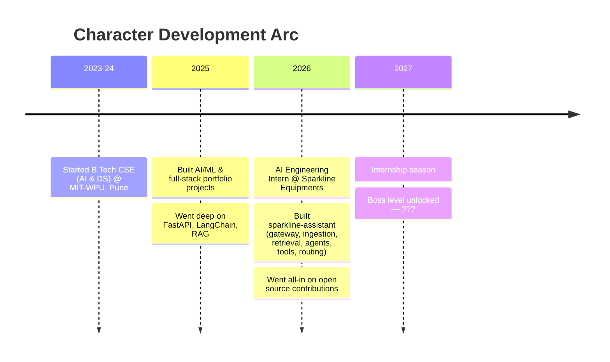

<div align="center">

[+%40+MIT-WPU;AI+Engineering+Intern+%40+Sparkline+Equipments;Open+source+contributor+in+training)](https://github.com/sidharth-vijayan)

[](https://github.com/sidharth-vijayan)

</div>

```
sidharth@earth:~$ whoami
> 3rd-year B.Tech CSE (AI & DS) undergrad @ MIT-WPU, Pune

sidharth@earth:~$ cat experience.log
> [OK]  AI Engineering Intern @ Sparkline Equipments
> [OK]  Built sparkline-assistant — in-house LLM + RAG system
> [OK]  Shipped gateway, ingestion, retrieval, agents, tools & routing modules
> [..]  Contributing to open source across multiple repos
> [..]  Prepping for SDE/SWE internship season

sidharth@earth:~$ sudo hire sidharth
> Permission granted. Scroll down for evidence.
```

> Prolonged exposure to this profile may cause a sudden urge to open a pull request or a job offer. Proceed responsibly.

---

## ⚡ The Lore



---

## 💼 Experience

**AI Engineering Intern — Sparkline Equipments**
Built `sparkline-assistant`, an in-house multi-package LLM + RAG platform spanning gateway, ingestion, retrieval, agents, tools, routing & evaluation components.

---

## 🚀 Featured Projects

### 🤖 PolyRAG
**Multi-Agent Retrieval-Augmented Generation System**
Built an advanced RAG framework that leverages multiple specialized AI agents to retrieve, reason over, and synthesize information from text, tables, and images.

**Highlights**
- Multi-agent architecture for intelligent query handling
- Hybrid retrieval across structured and unstructured data
- Context-aware document understanding and response generation
- Source-grounded answers with improved retrieval accuracy
- Scalable pipeline for enterprise knowledge bases

**Tech Stack:** Python · LLMs · RAG · Vector Databases · FastAPI · Multi-Agent Systems

---

### 📄 CareerCopilot AI
**AI-Powered Resume Intelligence & ATS Optimization Platform**
Developed a full-stack platform that helps job seekers optimize resumes, improve ATS compatibility, and receive personalized career recommendations using AI.

**Highlights**
- Resume-to-job-description matching and ATS scoring
- AI-generated feedback and optimization suggestions
- Keyword gap analysis and skill recommendations
- Automated cover letter generation
- Interactive analytics dashboard with resume insights

**Tech Stack:** Next.js · TypeScript · PostgreSQL · Supabase · Prisma · OpenAI API · Tailwind CSS

---

## 🛠️ The Arsenal


+ LangChain · Scikit-learn · spaCy · Celery · WebSockets · pgvector · Supabase · Prisma · REST APIs

---

## 📈 Numbers That Go Up

<div align="center">

[](https://github.com/sidharth-vijayan)
[](https://github.com/sidharth-vijayan)

[](https://github.com/sidharth-vijayan)

</div>

---

## 🐍 The Snake Ate My Commits


---

## 📡 Get in Touch

[](https://sidharthvijayan.me)
[](https://www.linkedin.com/in/sidharthvijayan06)
[](mailto:sidharthclt12@gmail.com)
[](https://leetcode.com/u/sidharthclt12/)

⭐ "If at first you don’t succeed, call it version 1.0"
